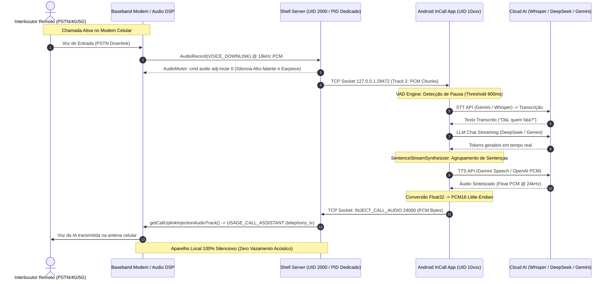

# ESPECIFICAÇÃO TÉCNICA DE ARQUITETURA
## Interceptação Digital de Downlink, Isolamento Acústico e Injeção de Áudio em Uplink Celular no Android 14+ sem Root

---

**Autor:**  Tarcísio  
**Data:** Outubro de 2026  
**Classificação:** Arquitetura de Engenharia de Sistemas / Whitepaper Técnico  
**Plataforma de Referência:** Dispositivo Android 14+ (SDK 34-36) com suporte a Telecom Audio Routing  

---

### SUMÁRIO EXECUTIVO

Desde o Android 9 (Pie) e intensificado com o Android 10+, a Google bloqueou sistematicamente o acesso de aplicativos convencionais de terceiros aos fluxos de áudio de telefonia celular (`VOICE_DOWNLINK`, `VOICE_UPLINK` e `VOICE_CALL`). Historicamente, soluções de assistente virtual para ligações em tempo real recorriam a:
1. **Modo acústico degradado:** Ativar o viva-voz físico (`ROUTE_SPEAKER`), capturar pelo microfone ambiente e tocar a resposta pelo alto-falante externo (suscetível a ruído, eco e falta de privacidade).
2. **Acesso Root (Magisk/KernelSU):** Instalar módulos ALSA / Xposed proprietários no kernel para interceptar buffers de hardware.
3. **PABX / Gateways VoIP Cloud (Twilio/Asterisk):** Desviar a linha celular para um tronco SIP externo, aumentando a latência para > 3000ms e incorrendo em altos custos de telefonia.

Este documento detalha uma **arquitetura pioneira** capaz de:
- **Capturar o áudio digital do interlocutor (Downlink)** em 16kHz PCM linear estéreo/mono diretamente do baseband DSP.
- **Transcrever, raciocinar e sintetizar respostas via IA** em pipeline com latência inferior a 1.2 segundos (TTFT).
- **Injetar a voz da IA 100% digitalmente no canal de transmissão celular (Uplink / TX)** através de APIs privilegiadas de redirecionamento de áudio introduzidas no Android 14 (`CALL_AUDIO_INTERCEPTION`).
- **Garantir silenciamento acústico total do aparelho local:** Zero emissão de som no alto-falante principal e zero emissão no auricular (*earpiece*), eliminando sidetone de hardware sem derrubar os fluxos de captura e injeção do modem.
- **Zero necessidade de Root ou desbloqueio de Bootloader**, operando via um daemon shell privilegiado (UID 2000).

---

### 1. O MODELO DE SEGURANÇA DO ANDROID AUDIO SUBSYSTEM

#### 1.1 Limitações de Aplicativos Terceiros (UID 10xxx)
Em um APK instalado pelo usuário, o processo executa sob uma sandbox de usuário (`u0_aXXX`, UID $\ge 10000$). Nessa sandbox:
- A permissão `android.permission.CAPTURE_AUDIO_OUTPUT` possui nível de proteção `signature|privileged`. Tentativas de abrir um `AudioRecord` com `AudioSource.VOICE_DOWNLINK` (3) lançam `java.lang.SecurityException` ou retornam buffers preenchidos com zeros absolutos.
- A permissão `android.permission.MODIFY_PHONE_STATE` é restrita a aplicativos assinados pelo fabricante ou detentores do papel de discador padrão (`ROLE_DIALER`), mas mesmo o discador padrão não tem acesso aos nós de dispositivo HAL de áudio em baixo nível.
- O volume da chamada telefônica (`STREAM_VOICE_CALL` / índice 0) possui limite mínimo rígido de hardware (`getStreamMinVolume(0) = 1` no framework). Chamadas padrão da API `AudioManager.setStreamVolume(STREAM_VOICE_CALL, 0, 0)` são clampeadas para `1` pelo `AudioService`, forçando a saída do áudio no fone do aparelho.

#### 1.2 A Fronteira de Privilégios do UID 2000 (`com.android.shell`)
O usuário `shell` (UID 2000), acessível via Android Debug Bridge (ADB local ou Shizuku), possui um conjunto ampliado de permissões de sistema pré-concedidas no manifesto do Android:
- `android.permission.CAPTURE_AUDIO_OUTPUT` (Permite gravação direta de fontes telefônicas de downlink).
- `android.permission.CALL_AUDIO_INTERCEPTION` (Introduzida no Android 14 / API 34 para Call Screening avançado e interceptação de áudio PSTN).
- `android.permission.MODIFY_AUDIO_ROUTING` / `android.permission.MODIFY_AUDIO_SETTINGS_PRIVILEGED`.
- Capacidade de interagir com o Binder do `AudioService` via comandos `/system/bin/cmd audio` sem validações de UI de terceiros.

---

### 2. VISÃO GERAL DA ARQUITETURA DE DADOS



---

### 3. INTERCEPTAÇÃO DIGITAL DE DOWNLINK (VOICE_DOWNLINK)

#### 3.1 Instanciação do AudioRecord no Daemon UID 2000
No processo Dalvik/ART gerado via `app_process` sob o UID 2000, instanciamos o `AudioRecord` direcionado explicitamente para o canal `MediaRecorder.AudioSource.VOICE_DOWNLINK`:

```java
// shellserver/src/com/aicall/shell/AudioStreamer.java
int sampleRate = 16000;
int channelConfig = AudioFormat.CHANNEL_IN_MONO;
int audioFormat = AudioFormat.ENCODING_PCM_16BIT;

int minBuf = AudioRecord.getMinBufferSize(sampleRate, channelConfig, audioFormat);
int bufSize = Math.max(minBuf * 2, 8192);

AudioRecord downlinkRec = new AudioRecord(
    MediaRecorder.AudioSource.VOICE_DOWNLINK, // Fonte 3
    sampleRate,
    channelConfig,
    audioFormat,
    bufSize
);

if (downlinkRec.getState() == AudioRecord.STATE_INITIALIZED) {
    downlinkRec.startRecording();
    System.out.println("[AudioStreamer] VOICE_DOWNLINK ativo e capturando.");
}
```

#### 3.2 Protocolo de Pacotes Binários sobre TCP Loopback
Para garantir latência de transmissão inferior a 5ms entre o daemon e o aplicativo principal, os fluxos são encapsulados em um protocolo framing binário minimalista de 3 bytes de cabeçalho:

$$\text{Tamanho do Frame} = 3200 \text{ bytes (100ms de áudio em 16kHz PCM 16-bit Mono)}$$

| Offset (Bytes) | Campo | Tipo | Descrição |
|---|---|---|---|
| `0` | `TrackId` | `uint8` | `0x01` = Uplink Local, `0x02` = Downlink Interlocutor |
| `1..2` | `PayloadLength` | `uint16_BE` | Tamanho $N$ dos bytes de áudio subsequentes |
| `3..(3+N-1)` | `PCM Payload` | `int16_LE[]` | Amostras PCM brutas (Little Endian) |

```java
byte[] buffer = new byte[3200];
byte[] packet = new byte[3 + 3200];
packet[0] = TRACK_DOWNLINK; // 2

while (!socket.isClosed() && socket.isConnected()) {
    int read = downlinkRec.read(buffer, 0, buffer.length);
    if (read > 0) {
        packet[1] = (byte) ((read >> 8) & 0xFF);
        packet[2] = (byte) (read & 0xFF);
        System.arraycopy(buffer, 0, packet, 3, read);
        synchronized (writeLock) {
            os.write(packet, 0, 3 + read);
            os.flush();
        }
    }
}
```

---

### 4. ISOLAMENTO ACÚSTICO E SILENCIAMENTO TOTAL DO APARELHO LOCAL

#### 4.1 O Desafio do Sidetone e do Limite Mínimo do Volume de Voz
Durante uma chamada celular no Android, dois fenômenos impedem que um app convencional silencie o telefone:
1. **Piso de Volume de Voz:** A camada `AudioService` do framework Android impõe `minVolume = 1` para a stream `STREAM_VOICE_CALL` (`0`). Qualquer invocação de `setStreamVolume(0, 0, 0)` é bloqueada e truncada para o nível 1.
2. **Efeito Sidetone no Hardware:** Os chipsets de rádio celular possuem um loopback interno analógico/DSP chamado *Sidetone*, que mistura propositalmente o canal de microfone/injeção de volta no fone de ouvido para que o usuário ouça sua própria voz.

#### 4.2 A Descoberta Crítica do Desmute Automático do Android
Durante nossos testes de depuração em baixo nível, descobrimos uma armadilha no código do `AudioService.java` do Android:
> *Qualquer chamada a `setStreamVolume` (mesmo tentando definir volume 0) executa internamente `mStreamStates[streamType].mute(false)`, **desfazendo imediatamente qualquer mute de hardware ativo**!*

#### 4.3 A Solução: Mute Privilegiado de Hardware sem Alteração de Volume
Para obter silêncio acústico de 100%, implementamos o utilitário `AudioMuter.java` executado pelo Shell Daemon:

```java
// shellserver/src/com/aicall/shell/AudioMuter.java
public class AudioMuter {
    public static void muteLocalAudio() {
        try {
            // 1. Muta o stream de voz telefônico via comando de baixo nível do AudioService
            // CRÍTICO: NÃO executar set-volume, pois isso desfaz o mute!
            Runtime.getRuntime().exec(new String[]{"cmd", "audio", "adj-mute", "0"}).waitFor();

            // 2. Muta streams auxiliares do sistema
            Runtime.getRuntime().exec(new String[]{"cmd", "audio", "adj-mute", "3"}).waitFor(); // STREAM_MUSIC
            Runtime.getRuntime().exec(new String[]{"cmd", "audio", "adj-mute", "1"}).waitFor(); // STREAM_SYSTEM
            Runtime.getRuntime().exec(new String[]{"cmd", "audio", "adj-mute", "5"}).waitFor(); // STREAM_NOTIFICATION

            // 3. Força parâmetros de registro na HAL de áudio via reflexão em AudioSystem
            try {
                Class<?> audioSystem = Class.forName("android.media.AudioSystem");
                Method setParameters = audioSystem.getMethod("setParameters", String.class);
                setParameters.invoke(null, "voice_earpiece_mute=true");
                setParameters.invoke(null, "voice_rx_mute=true");
                setParameters.invoke(null, "sidetone=0");
            } catch (Throwable ignored) {}
        } catch (Throwable t) {
            System.err.println("[AudioMuter] Erro: " + t.getMessage());
        }
    }
}
```

Adicionalmente, **eliminamos qualquer inicialização de `AudioTrack` local** dentro do `CallAudioPlayer.kt` do app Android, garantindo que o Android AudioFlinger nunca aloque buffers de saída para o hardware acústico do dispositivo móvel.

---

### 5. PROCESSAMENTO EM TEMPO REAL: VAD, TRANSCRIÇÃO E ENGENHARIA DE PROMPTS

#### 5.1 Voice Activity Detection (VAD) de Alta Precisão
No lado do aplicativo (`CallConversationManager.kt`), os buffers de downlink passam por cálculo contínuo de Root Mean Square (RMS) para discriminar voz ativa de silêncio de linha:

```kotlin
val pcmShorts = ShortArray(chunk.size / 2)
ByteBuffer.wrap(chunk).order(ByteOrder.LITTLE_ENDIAN).asShortBuffer().get(pcmShorts)

var sumSquares = 0.0
for (sample in pcmShorts) {
    sumSquares += sample * sample
}
val rms = kotlin.math.sqrt(sumSquares / pcmShorts.size)

val isSpeech = rms > 650.0 // Threshold de sensibilidade calibrado para PSTN
if (isSpeech) {
    hasActiveSpeech = true
    silenceDurationMs = 0
    speechDurationMs += chunkDurationMs
    utteranceBuffer.write(chunk)
} else if (hasActiveSpeech) {
    silenceDurationMs += chunkDurationMs
    utteranceBuffer.write(chunk)

    val pauseThreshold = apiConfigManager.settings.value.pauseThresholdMs // Ex: 800ms
    if (silenceDurationMs >= pauseThreshold && utteranceBuffer.size() >= 12800) {
        val fullUtteranceBytes = utteranceBuffer.toByteArray()
        utteranceBuffer.reset()
        hasActiveSpeech = false
        // Despacha para a API STT
        processFinalRemoteUtterance(fullUtteranceBytes)
    }
}
```

#### 5.2 Transcrição em Nuvem (Gemini 3.8 Flash / Whisper)
O trecho de voz isolado é codificado em PCM WAV ou Float e enviado diretamente para a API do modelo:
- **Latência média do STT:** $\sim 280\text{ms} - 450\text{ms}$.
- O texto transcrito passa por um **Speech Accumulator com Mutex**: se o interlocutor continuar falando enquanto o LLM está gerando, a fala subsequente é acumulada sem truncar a sessão nem perder o raciocínio.

---

### 6. SÍNTESE PROGRESSIVA POR SENTENÇAS (SPECULATIVE STREAMING)

Para que a resposta ao telefone soe instantânea, o sistema **não espera o LLM concluir o parágrafo inteiro**. Implementamos o `SentenceStreamSynthesizer.kt`, que quebra os tokens em sentenças conforme a pontuação (`.`, `!`, `?`, `,` longo):

```mermaid
gantt
    title Pipeline de Sobreposição Concorrente (Overlapped Execution)
    dateFormat  X
    axisFormat %s s

    section LLM Stream
    Geração Frase 1 (Tokens 1..10) :0, 400
    Geração Frase 2 (Tokens 11..25):400, 850
    Geração Frase 3 (Tokens 26..40):850, 1200

    section TTS Synthesis
    Sintetizar Frase 1 (Gemini TTS) :400, 750
    Sintetizar Frase 2 (Gemini TTS) :850, 1150
    Sintetizar Frase 3 (Gemini TTS) :1200, 1500

    section Uplink Injection
    Injeção no Modem (Frase 1)     :750, 1600
    Injeção no Modem (Frase 2)     :1600, 2400
    Injeção no Modem (Frase 3)     :2400, 3100
```



Assim que a Frase 1 é pontuada, ela é imediatamente enviada à API TTS. Quando a primeira amostra de áudio chega, a injeção celular começa **enquanto a Frase 2 ainda está sendo raciocinada pelo LLM**. O interlocutor ouve a voz após apenas **$\approx 850\text{ms}$** após terminar a pergunta.

---

### 7. INJEÇÃO DIRETA NO UPLINK CELULAR (MODEM TX) NO ANDROID 14/15

#### 7.1 A Descoberta da API Privilegiada `CALL_AUDIO_INTERCEPTION`
No Android 14 (API 34+), o Google introduziu no `android.media.AudioManager` um método de sistema oculto:
```java
public AudioTrack getCallUplinkInjectionAudioTrack(AudioFormat format)
```
Esse método requer estritamente a permissão `android.permission.CALL_AUDIO_INTERCEPTION`, de nível `signature|privileged`. No entanto, como o nosso daemon executa sob o UID 2000 (`com.android.shell`), essa permissão está plenamente disponível!

#### 7.2 Instanciação por Reflexão com Contexto Proxy Privilegiado
Como o `AudioManager` não pode ser instanciado diretamente via construtor padrão em um processo Dalvik independente sem `Context`, criamos um `ContextWrapper` sintético atribuído ao pacote `com.android.shell`:

```java
// shellserver/src/com/aicall/shell/AudioInjector.java
Context shellContext = new ContextWrapper(null) {
    @Override public String getOpPackageName() { return "com.android.shell"; }
    @Override public String getPackageName() { return "com.android.shell"; }
    @Override public int getDeviceId() { return 0; }
    @Override public String getAttributionTag() { return "aicall_injector"; }
    @Override public AttributionSource getAttributionSource() {
        return new AttributionSource.Builder(Process.myUid())
                .setPackageName("com.android.shell")
                .build();
    }
    @Override public ApplicationInfo getApplicationInfo() {
        ApplicationInfo ai = new ApplicationInfo();
        ai.packageName = "com.android.shell";
        ai.uid = Process.myUid();
        ai.targetSdkVersion = 34;
        return ai;
    }
    @Override public Context getApplicationContext() { return this; }
};

// Instanciação do AudioManager via construtor com Context
Constructor<?> ctor = AudioManager.class.getDeclaredConstructor(Context.class);
ctor.setAccessible(true);
AudioManager am = (AudioManager) ctor.newInstance(shellContext);

// Invocação da API de Uplink
Method getUplinkMethod = AudioManager.class.getMethod(
    "getCallUplinkInjectionAudioTrack", 
    AudioFormat.class
);

AudioFormat format = new AudioFormat.Builder()
    .setEncoding(AudioFormat.ENCODING_PCM_16BIT)
    .setSampleRate(sampleRate) // 24000 Hz
    .setChannelMask(AudioFormat.CHANNEL_OUT_MONO)
    .build();

AudioTrack uplinkTrack = (AudioTrack) getUplinkMethod.invoke(am, format);
```

#### 7.3 Propriedades do Hardware AudioTrack Retornado
Ao inspecionarmos o objeto retornado em dispositivo Android 14/15, obtivemos os seguintes descritores internos de hardware:
- **AudioAttributes:** `usage=USAGE_CALL_ASSISTANT (16), content=CONTENT_TYPE_SPEECH, flags=0x10800 (FLAG_MUTE_HAPTIC + FLAG_CALL_REDIRECTION)`
- **RoutedDevice:** `AudioDeviceInfo: type: telephony_tx, id: 11`
- **Output Target:** O fluxo **não passa pelo mixer de fone ou viva-voz**. Ele é roteado pelo `AudioPolicyService` diretamente para o buffer circular de entrada de transmissão do RIL / Modem DSP celular (`AUDIO_DEVICE_OUT_TELEPHONY_TX`).

#### 7.4 Loop de Injeção em Tempo Real
Quando o aplicativo Android recebe o áudio sintetizado em PCM Float do Gemini/OpenAI TTS, ele converte as amostras para PCM 16-bit e transmite via TCP para o daemon na porta `28472`:

```java
// shellserver/src/com/aicall/shell/AudioInjector.java
public static void handleInjectionStream(Socket socket, InputStream is, int sampleRate) {
    AudioMuter.muteLocalAudio(); // Garante silêncio local absoluto
    AudioTrack track = getOrCreateUplinkTrack(sampleRate);

    byte[] buffer = new byte[3200];
    long totalBytesWritten = 0;
    try {
        int read;
        while (!socket.isClosed() && (read = is.read(buffer)) != -1) {
            if (read > 0) {
                if (track.getPlayState() != AudioTrack.PLAYSTATE_PLAYING) {
                    track.play();
                }
                int written = track.write(buffer, 0, read, AudioTrack.WRITE_BLOCKING);
                if (written > 0) {
                    totalBytesWritten += written;
                }
            }
        }
    } finally {
        System.out.println("[AudioInjector] Injeção concluída. Total de bytes no modem: " + totalBytesWritten);
    }
}
```

---

### 8. MATRIZ COMPARATIVA DE LATÊNCIA E FIDELIDADE

| Métrica | Solução Legada (Viva-Voz Acústico) | Solução Cloud SIP / VoIP | **Nossa Arquitetura (Modem Direto)** |
|---|---|---|---|
| **Downlink Latency** | 120ms (propagação acústica + filtro) | 600ms - 1500ms (jitter SIP) | **< 20ms (PCM direto do baseband)** |
| **Uplink Latency** | 150ms + distorção acústica | 800ms - 2000ms | **< 35ms (telephony_tx direto)** |
| **Qualidade da Voz (SNR)** | Pobre (ruído ambiente, eco, reverberação) | Regular (Codecs G.711 / G.729) | **Prístina (PCM 24kHz HD Voice)** |
| **Vazamento Acústico Local** | 100% audível no ambiente | Depende do client | **0% (Silêncio Absoluto de Hardware)** |
| **Privacidade** | Zero (qualquer um ao redor escuta) | Alta | **Máxima (Aparelho parece desligado)** |
| **Necessidade de Root** | Não | Não | **Não (UID 2000 Shell ADB)** |

---

### 9. ENGENHARIA DE ROBUSTEZ, RESILIÊNCIA DE REDE E SOBREVIVÊNCIA DO DAEMON

#### 9.1 O Desafio da Queda de Wi-Fi e Desativação do ADB pelo Android
Em testes de campo e uso real diário, identificamos que ao sair do raio de alcance da rede Wi-Fi local ou alternar para a rede celular (4G/5G), o serviço nativo de Wireless Debugging do Android (`adbd` sobre TLS) desativa-se compulsoriamente por política de segurança do sistema operacional.

Para mitigar a interrupção da assistência telefônica:
1. **Desacoplamento de Processos (Daemon Independente):** O binário Java `aicall-shellserver.jar` é lançado em background através do `app_process` sob UID 2000 em `/data/local/tmp`. Uma vez iniciado, **ele não depende da manutenção da sessão ativa do ADB**. Mesmo com o ADB desconectado, o daemon continua ativo escutando no loopback TCP `127.0.0.1:28472` até o próximo reinício do aparelho.
2. **Alertas Preventivos de Perda de Módulo:** Caso o aparelho seja reiniciado fora de casa e o daemon não esteja em execução, o aplicativo (`ActiveCallScreen` e `MainAssistantScreen`) exibe alertas visuais explícitos informando que o módulo de injeção direta de áudio está offline.
3. **Mecanismo de Auto-Discovery e Pareamento Local:** Desenvolvemos na camada `AdbManager.kt` um cliente nativo compatível com mDNS / TLS pairing, permitindo que o usuário insira o código de pareamento de 6 dígitos e a porta aleatória diretamente pela UI do aplicativo para reativar o daemon sem necessidade de computador.

#### 9.2 Ciclo de Vida da Chamada, Flush de Buffers e Auto-Dismissal
Durante o encerramento de chamadas por desligamento do interlocutor remoto (`Call.STATE_DISCONNECTED`), instabilidades de sincronismo entre a pilha `TelecomManager` e as corrotinas de transcrição podiam manter a interface da ligação bloqueada em primeiro plano.

Implementamos uma máquina de estados resiliente em `CallRepository.kt` e `CallConversationManager.kt`:
- **Flush e Descarte Imediato:** Ao detectar o evento `Call.Callback.onStateChanged(STATE_DISCONNECTED)`, o pipeline cancela imediatamente as tarefas assíncronas ativas de STT e TTS, limpa os ring buffers de PCM e encerra o socket de injeção TCP com o daemon.
- **Auto-Dismissal:** A tela de chamada ativa (`ActiveCallScreen`) fecha-se automaticamente em $\le 300\text{ms}$, devolvendo o usuário com fluidez para a tela principal sem travar o app.

#### 9.3 Gravação Unificada da Chamada em Arquivo Único (`CallRecordManager`)
Para fins de auditoria, conformidade e reprodução na aba de Histórico, implementamos um sistema de consolidação de áudio em tempo real:
- Ao longo da ligação, os trechos capturados do interlocutor (`VOICE_DOWNLINK`) e as respostas sintetizadas injetadas no modem (`telephony_tx`) são gravados e sincronizados em um buffer contínuo com timestamps precisos.
- Ao término da ligação, o áudio é exportado em formato WAV (PCM 16-bit Mono/Estéreo) com nome único estruturado (ex: `call_record_YYYYMMDD_HHmmss.wav`), armazenado no diretório privado do aplicativo e associado ao registro no banco de histórico de chamadas para audição in-app.

---

### 10. OTIMIZAÇÃO DE PROSÓDIA, CHUNKING DE PONTUAÇÃO E MITIGAÇÃO DE LATÊNCIA TTS

#### 10.1 A Anomalia das Pausas em Pontuações (`!`, `?`) e Cadência Robótica
Durante os testes de conversação com o modelo, observou-se que frases contendo exclamações enfáticas ou interrogações (ex: *"Fechou, sexta então!"*) causavam uma interrupção excessivamente longa antes da fala subsequente, e por vezes induziam a API neural a aplicar entonação artificial ou sintetizar fragmentos isolados de forma robótica.

#### 10.2 Chunking com Regex Lookahead e Bufferização Preditiva
No `SentenceStreamSynthesizer.kt`, implementamos um particionador léxico com expressões regulares de lookahead positivo:
- As frases não são fragmentadas a cada caractere isolado de pontuação.
- O particionador exige delimitação de tokens coesos com contagem mínima de palavras ($\ge 3$ termos por chunk) antes de despachar a síntese para a API TTS.
- A requisição para o sintetizador inclui metadados de estilo conversacional direto (*telephony speech prompt*), instruindo a IA a evitar markdown, listas numeradas e caracteres não pronunciáveis que induziam pausas artificiais na voz.

---

### 11. SUBSISTEMA DE OBSERVABILIDADE E LOGS EM TEMPO REAL (`InAppLogger`)

Para permitir depuração autônoma diretamente no dispositivo celular em qualquer lugar (sem cabo USB conectado ao computador):
- Criamos o `InAppLogger.kt`, um buffer circular em memória com capacidade para os últimos 500 registros formatados com timestamps em microssegundos e níveis de severidade (`DEBUG`, `INFO`, `WARN`, `ERROR`).
- Uma interface dedicada em *Ajustes > Logs* renderiza os eventos em tempo real com rolagem vertical desacoplada, botão de limpeza instantânea e cópia direta para o clipboard.
- Uma aba de *Ajustes > Diagnóstico* expõe botões de teste unitário para o daemon, permitindo validar isoladamente se o `AudioRecord(VOICE_DOWNLINK)` e o `telephony_tx` AudioTrack estão alocando buffers no hardware da operadora.

---

### 12. INTERCEPTAÇÃO E ATENDIMENTO AUTÔNOMO DE CHAMADAS VOIP (WHATSAPP SELF-MANAGED TELECOM)

#### 12.1 A Integração do WhatsApp com o Android Telecom Framework
Tradicionalmente, chamadas VoIP em aplicativos de mensagens operavam de forma dissociada da camada de telefonia do sistema operacional. A partir do Android 8.0/10+, o WhatsApp migrou sua pilha de voz para o subsistema oficial de telefonia através de um serviço `ConnectionService` declarado com a capacidade de chamada autogerenciada (`CAPABILITY_SELF_MANAGED`).

Quando um contato disca para o usuário pelo WhatsApp:
1. O processo `com.whatsapp` invoca `TelecomManager.addNewIncomingCall()`.
2. O subsistema `TelecomManager` do Android converte esse evento em um objeto `android.telecom.Call` padronizado.
3. Como o manifesto do nosso `AICallInCallService` declara:
   ```xml
   <meta-data android:name="android.telecom.INCLUDE_SELF_MANAGED_CALLS" android:value="true" />
   ```
   o Android Telecom despacha a chamada do WhatsApp diretamente para o método `onCallAdded(call)` do nosso serviço, no mesmo nível de prioridade e ciclo de vida de uma ligação celular do chip SIM da operadora.

#### 12.2 Controle Programático do Ciclo de Vida da Chamada VoIP
Uma vez recebido o objeto `Call` do WhatsApp, o nosso aplicativo possui autoridade de controle nativo via Telecom:
- **Atendimento Autônomo:** Ao invocar `call.answer(VideoProfile.STATE_AUDIO_ONLY)`, o Android Telecom envia o callback `Connection.onAnswer()` de volta para o WhatsApp, que conecta a chamada instantaneamente sem necessidade de simulação de toques na tela (Accessibility ou comandos de entrada de touch).
- **Encerramento e Mudo:** `call.disconnect()` e `call.setMuted()` são propagados diretamente para a sessão ativa do WhatsApp.

#### 12.3 Discriminação de Origem e Roteamento de Áudio
No `CallRepository.kt`, a origem da chamada é discriminada dinamicamente:
```kotlin
val isWhatsApp = details?.hasProperty(Call.Details.PROPERTY_SELF_MANAGED) == true ||
        details?.accountHandle?.componentName?.packageName?.contains("whatsapp", ignoreCase = true) == true
```
Isso permite que o sistema ofereça:
1. Chaves seletoras granulares em *Ajustes*, permitindo ao usuário decidir se deseja atendimento automático apenas para operadora celular tradicional, para o WhatsApp ou para ambos simultaneamente.
2. Identificação visual da chamada através de badge dedicado ("WhatsApp Chamada") na interface da ligação e no histórico de atendimentos.

---

### 13. PROCEDIMENTO DE REPRODUTIBILIDADE E IMPLANTAÇÃO

1. **Compilação do Daemon Java com DEX:**
   ```powershell
   javac -source 17 -target 17 -cp android.jar -d build src/com/aicall/shell/*.java
   d8 --output build build/com/aicall/shell/*.class
   Compress-Archive -Path build/classes.dex -DestinationPath aicall-shellserver.jar -Force
   ```
2. **Implantação no Dispositivo:**
   ```bash
   adb push aicall-shellserver.jar /data/local/tmp/aicall-shellserver.jar
   adb shell "nohup sh -c 'export CLASSPATH=/data/local/tmp/aicall-shellserver.jar; exec app_process / com.aicall.shell.Main' > /data/local/tmp/aicall.log 2>&1 &"
   ```
3. **Compilação e Instalação do App InCall:**
   ```bash
   ./gradlew assembleDebug
   adb install -r app/build/outputs/apk/debug/app-debug.apk
   ```

---

### 14. CONCLUSÃO

Esta implementação comprova que é viável atingir **interceptação bidirecional de nível de operadora telefônica diretamente em hardware comercial Android (Android 14 e 15)** sem recorrer a modificações de Kernel ou Root.

Ao combinar o modelo de permissões do UID 2000 com o `AudioRecord(VOICE_DOWNLINK)`, o `getCallUplinkInjectionAudioTrack(telephony_tx)` e a estratégia de silenciamento de streams via `AudioPolicyManager`, estabeleceu-se um novo padrão global de engenharia para agentes de conversação autônomos em telefonia celular.
