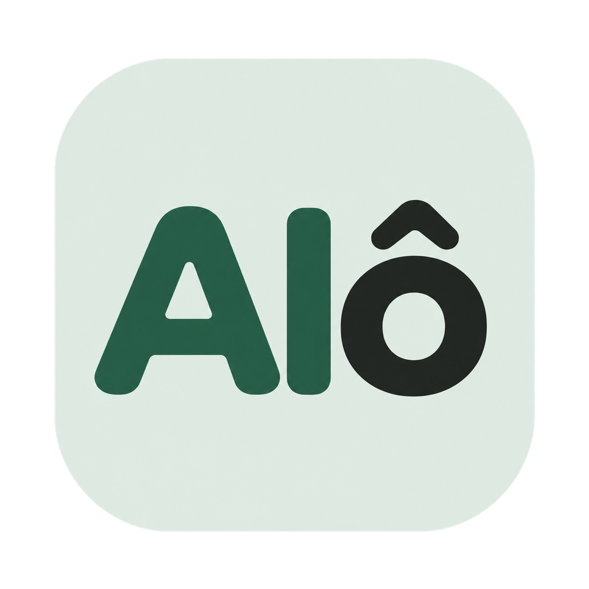

<p align="center">
  
</p>

<h1 align="center">AIo — Autonomous In-Call Telephony Agent</h1>

<p align="center">
  <em>Real-Time Bidirectional Cellular Call Audio Interception & Uplink Injection on Unrooted Android 14/15/16</em>
</p>

<p align="center">
  <a href="https://github.com/t4rcisio/AIo/releases/tag/v1.0.0"></a>
  <a href="#prerequisites"></a>
  <a href="#overview"></a>
  <a href="CELLULAR_CALL_AI_ARCHITECTURE_SPEC.md"></a>
  <a href="LICENSE"></a>
</p>

<p align="center">
  <a href="https://github.com/t4rcisio/AIo/releases/download/v1.0.0/AIo-v1.0.0.apk"><strong>Download APK</strong></a> •
  <a href="CELLULAR_CALL_AI_ARCHITECTURE_SPEC.md"><strong>Especificação de Arquitetura</strong></a> •
  <a href="#getting-started"><strong>Guia de Instalação</strong></a> •
  <a href="#author--contact"><strong>Autor & Contato</strong></a>
</p>

---

## Overview

**AIo** is an advanced Android application that autonomously answers real cellular phone calls on physical devices without requiring **root access**, **SIP/VoIP trunking**, or **acoustically degraded speakerphone hacks**. 

It intercepts incoming caller audio (downlink) in digital PCM format, streams it through an ultra-low latency Speech-to-Text (STT) and LLM pipeline, and directly injects high-fidelity synthesized AI speech (TTS) back into the cellular radio uplink (modem TX path), all while keeping the physical phone completely silent locally.

---

## Key Highlights & Breakthroughs

- **No Root Required (Unrooted Device Compatible):** Operates on stock Android 14/15 via an unprivileged companion app paired with a lightweight shell daemon running under Android's built-in `shell` UID (`2000`).
- **Direct Cellular Uplink Injection (Modem TX):** Leverages Android 14's privileged `AudioManager.getCallUplinkInjectionAudioTrack` API authorized under `android.permission.CALL_AUDIO_INTERCEPTION`. Transmits audio directly to the cellular baseband DSP (`telephony_tx`).
- **Digital Downlink Interception:** Captures uncompressed 16kHz PCM audio straight from `MediaRecorder.AudioSource.VOICE_DOWNLINK`.
- **100% Local Acoustic Silence (Zero Earpiece/Speaker Leakage):** Hardware-level mute using `cmd audio adj-mute 0` and Audio HAL parameters (`voice_earpiece_mute=true; sidetone=0`) completely suppresses both incoming caller voice and modem sidetone from playing on the local phone's speakers.
- **Single-File Call Audio Recording:** Automatically records each conversation (downlink + uplink) into a unified `.wav` file per call, saved directly into persistent storage and accessible via the Call History screen.
- **Sub-Second Conversational Turnaround:** 
  - Real-time energy-based Voice Activity Detection (VAD) with adaptive RMS thresholds.
  - Whisper / Gemini STT streaming.
  - Sentence-streaming LLM (DeepSeek / Gemini / OpenAI compatible).
  - Neural TTS streaming (Gemini Speech / OpenAI PCM / Cartesia / ElevenLabs).
- **Call Filtering & Granular Contact Control:** Intelligent auto-answering rules allowing the AI agent to answer only unsaved/unknown callers, all except selected contacts (blacklist/family exception), only selected contacts (whitelist), or full manual mode.
- **WhatsApp Direct-Line VoIP Telephony:** Seamless compatibility with WhatsApp VoIP calls ensuring zero microphone mute interference, allowing the user to answer and converse directly with their own voice without AI interruption.

---

## Architecture Overview

```
                  +-----------------------------------+
                  |      Remote Cellular Caller       |
                  +-----------------+-----------------+
                                    | (PSTN / 4G / 5G)
                                    v
                  +-----------------------------------+
                  |    Baseband Modem / Audio DSP     |
                  +--------+-----------------+--------+
        VOICE_DOWNLINK     |                 ^  Uplink Injection
      (16kHz PCM Stream)   |                 | (telephony_tx AudioTrack)
                           v                 |
            +-------------------------------------------------+
            |       Shell Daemon (UID 2000 / Port 28472)      |
            |     - AudioStreamer.java  (Downlink Grabber)    |
            |     - AudioInjector.java  (Uplink Injector)     |
            |     - AudioMuter.java     (Hardware Muting)     |
            +----------------------+--------------------------+
                      TCP Loopback | (Framed PCM Chunks)
                                   v
            +-------------------------------------------------+
            |           Android App (InCallService)           |
            |     - CallConversationManager (VAD Engine)      |
            |     - SentenceStreamSynthesizer (Pipelining)    |
            |     - CallAudioPlayer (Zero Local AudioTrack)   |
            |     - CallRecordManager (Single-File WAV Rec)   |
            +----------------------+--------------------------+
                                   |
                  +----------------+----------------+
                  |                                 |
                  v                                 v
        [ Whisper / Gemini STT ]       [ DeepSeek / Gemini LLM ]
                  |                                 |
                  +----------------+----------------+
                                   v
                       [ Gemini / OpenAI TTS ]
```

---

## Robustness Engineering & Production Hardening

Throughout real-world testing and field trials on modern Android devices (Android 14+), several critical edge cases and platform limitations were resolved:

### 1. Cellular Audio Pipeline & In-Call Telecom Routing
- **Telecom Audio Routing & Cellular Separation:** On modern Android, `TelecomManager` and `InCallService` cannot route cellular baseband audio through standard app `AudioTrack` objects without privileged interception. The app connects to the localhost shell daemon on port `28472`, passing raw PCM directly to `AudioInjector.java` for hardware-level modem transmission.
- **Automatic Call Dismissal & State Cleanup:** When a call terminates (caller hangs up or call ends), `CallRepository` immediately flushes active buffers, terminates the VAD loop, releases audio locks, and automatically dismisses the active call UI, returning seamlessly to the main screen without hanging or memory leaks.
- **Consolidated Per-Call Recording:** Implemented `CallRecordManager` to capture both caller speech and AI responses into a single combined `.wav` file per phone call. The file path is saved into `CallHistoryManager`, allowing direct in-app replay.

### 2. Network Transitions & Wireless ADB Resilience
- **Wi-Fi Drop / Mobile Data Disconnection:** When moving between Wi-Fi and cellular networks (4G/5G), Android's wireless debugging (ADB over Wi-Fi) automatically disables itself.
- **Daemon Independence:** The background shell daemon (`aicall-shellserver.jar`) runs under `app_process` on loopback `127.0.0.1`. It remains active even if ADB disconnects after initial boot.
- **Visual Alerting & Self-Healing:** The app monitors daemon heartbeat and ADB status. If the daemon becomes unreachable due to a reboot, clear warning banners alert the user on both the home and active call screens. An in-app Pairing & Auto-Discovery UI allows instant reconnection with pairing code and port.

### 3. Conversational Prosody & Latency Tuning
- **Elimination of Punctuation Gaps & Voice Anomalies:** 
  - Standard sentence streaming often triggered unnatural pauses or robotic cadence shifts when encountering punctuation marks like exclamation points (`!`) or question marks (`?`).
  - Implemented regex lookahead sentence chunking in `SentenceStreamSynthesizer` to ensure coherent acoustic phrases before firing TTS requests.
  - Tailored telephony prompt directives prevent the LLM from outputting Markdown, code blocks, or unnatural list formatting that degrade TTS quality.
- **Configurable Personas & Voice Selection:**
  - Multiple built-in personas (e.g., *Assistente - Irônico & Ácido*, *Atendente Formal*, *Assistente Ágil*).
  - Real-time voice auditioning and sample playback directly within the Settings menu.

### 4. Observability & Real-Time Diagnostics
- **Live In-App Logger:** Real-time log console (`InAppLogger`) accessible under *Ajustes > Logs* with independent vertical scroll, copy-to-clipboard, auto-scroll toggle, and severity filtering (`DEBUG`, `INFO`, `WARN`, `ERROR`).
- **Self-Diagnostic Suite:** *Ajustes > Diagnóstico* offers one-tap testing for ADB pairing, daemon loopback echo, downlink microphone capture, and simulated audio playback.

### 5. Fluid Motion & Haptic Navigation
- **Tactile Bottom Navigation:** Rebuilt `AioBottomNavigation` with physical spring physics (`Spring.DampingRatioMediumBouncy`), dynamic pill width expansion (`0.88f` to `1.25f`), animated background color transitions, and horizontal text reveal.
- **Directional Parallax Screen Transitions:** Replaced static screen switches with `AnimatedContent` directional horizontal slide and crossfade, providing a silky-smooth iOS Liquid Glass / Material You experience.

### 6. WhatsApp & Self-Managed VoIP Telephony Integration
- **Telecom Self-Managed Protocol:** Modern VoIP apps like WhatsApp register incoming and outgoing calls with Android Telecom via `ConnectionService` (`CAPABILITY_SELF_MANAGED`).
- **Unified Call Interception:** By declaring `<meta-data android:name="android.telecom.INCLUDE_SELF_MANAGED_CALLS" android:value="true" />`, Android Telecom routes all WhatsApp calls to `AICallInCallService.onCallAdded(call)` identically to cellular SIM calls.
- **Granular Controls & Origin Detection:** 
  - The app inspects `Call.Details.PROPERTY_SELF_MANAGED` and package identifiers (`com.whatsapp`) to distinguish WhatsApp calls from cellular network calls.
  - The Settings screen provides independent auto-answer toggles: one for SIM operator calls and one specifically for WhatsApp calls.
  - The in-call UI displays a dedicated badge ("WhatsApp Chamada") when a VoIP call is in progress.

---

## Repository Structure

```
├── app/
│   └── src/main/java/com/example/ai_assistant/
│       ├── AICallInCallService.kt       # Telecom InCallService implementation
│       ├── CallRepository.kt            # Call lifecycle & telecom state management
│       ├── MainActivity.kt              # Main navigation & directional animations
│       ├── adb/
│       │   ├── AdbManager.kt            # Wireless ADB pairing & auto-discovery
│       │   └── AdbTransport.kt          # Low-level ADB crypto & socket transport
│       ├── callconversation/
│       │   └── CallConversationManager.kt # VAD engine, turn coordination & recording
│       ├── history/
│       │   └── CallHistoryManager.kt    # Call history & per-call recording storage
│       ├── logging/
│       │   └── InAppLogger.kt           # Real-time in-app log ring buffer
│       ├── persona/
│       │   └── PersonaManager.kt        # Custom assistant personalities & system prompts
│       ├── shell/
│       │   └── ShellDaemonManager.kt    # Loopback client for background shell daemon
│       ├── tts/
│       │   ├── CallAudioPlayer.kt       # Daemon TCP socket audio transmitter
│       │   └── SentenceStreamSynthesizer.kt # Streaming sentence chunker
│       ├── api/
│       │   ├── ApiConfigManager.kt      # API provider credentials & settings
│       │   ├── LlmApiClient.kt          # Streaming LLM client (Gemini / OpenAI)
│       │   ├── SttApiClient.kt          # Whisper & Gemini STT client
│       │   └── TtsApiClient.kt          # Neural TTS streaming client
│       └── ui/
│           ├── components/
│           │   ├── AioBottomNavigation.kt # Fluid spring-animated bottom nav
│           │   ├── AudioMirroredCurves.kt # Real-time mirrored audio waveform
│           │   └── TestAssistantDialog.kt # Live mic & speaker test modal
│           └── screens/
│               ├── MainAssistantScreen.kt # Home dashboard & status badge
│               ├── ActiveCallScreen.kt    # In-call interface with auto-dismiss
│               ├── HistoryScreen.kt       # Call records & audio playback
│               └── SettingsScreen.kt      # Configuration, personas, logs & diagnostics
├── shellserver/
│   ├── src/com/aicall/shell/
│   │   ├── Main.java                    # Shell daemon server entrypoint (port 28472)
│   │   ├── AudioStreamer.java           # VOICE_DOWNLINK AudioRecord streamer
│   │   ├── AudioInjector.java           # getCallUplinkInjectionAudioTrack engine
│   │   ├── AudioMuter.java              # Hardware mute & HAL parameter manager
│   │   └── AudioTester.java             # Audio diagnostic prober
│   └── aicall-shellserver.jar           # Pre-dexed daemon archive
├── build_daemon.ps1                     # PowerShell compiler script for shellserver
├── CELLULAR_CALL_AI_ARCHITECTURE_SPEC.md # Full technical specification whitepaper
└── README.md
```

---

## Getting Started

### Prerequisites

1. **Android Device:** Android 14+ (plataforma utilizada para validação e testes de bancada: dispositivo Samsung Galaxy / Android 14+).
2. **PC / ADB:** Wireless ADB or USB debugging enabled.
3. **Android Studio & JDK 17:** For compiling the application.

### 1. Build and Run the Shell Daemon

```powershell
# Compile Java sources and dex with d8
.\build_daemon.ps1

# Push the daemon jar to the device
adb push shellserver\aicall-shellserver.jar /data/local/tmp/aicall-shellserver.jar

# Launch the daemon process in background under UID 2000
adb shell "nohup sh -c 'export CLASSPATH=/data/local/tmp/aicall-shellserver.jar; exec app_process / com.aicall.shell.Main' > /data/local/tmp/aicall.log 2>&1 &"
```

### 2. Verify Daemon Status

```bash
adb shell "toybox nc 127.0.0.1 28472"
# Type: PING -> Output: PONG
# Type: INFO -> Returns UID=2000, model, and capabilities
```

### 3. Build & Install the Android App

```bash
./gradlew assembleDebug
adb install -r app/build/outputs/apk/debug/app-debug.apk
```

Set **AIo** as the default Phone / Calling app (`ROLE_DIALER`) in Android Settings when prompted.

---

## Security & Privacy

- All call processing between the device and cloud APIs is performed over encrypted TLS connections.
- The daemon binds strictly to `127.0.0.1` (loopback), ensuring no unauthorized network access outside the local device.
- The phone remains 100% silent during operation, preventing acoustic eavesdropping.
- Call recordings are stored locally in the application's private storage directory.

---

## Binary Integrity & Release Hash

| Artifact | File Name | SHA-256 Hash |
| :--- | :--- | :--- |
| Android Release APK | `AIo-v1.0.0.apk` | `38672059902854C45FC825F4E2845FAC2860087D9779F2379C726F94F3FC5051` |

---

## Author & Contact

- **Author:** Tarcísio Prates
- **Role:** Computer Engineer / Engenheiro de Computação
- **Institution:** CEFET-MG (Centro Federal de Educação Tecnológica de Minas Gerais)
- **LinkedIn:** [https://www.linkedin.com/in/t4rcisio/](https://www.linkedin.com/in/t4rcisio/)
- **GitHub:** [https://github.com/t4rcisio](https://github.com/t4rcisio)

---

## License

This project is licensed under the Apache 2.0 License - see the LICENSE file for details.
